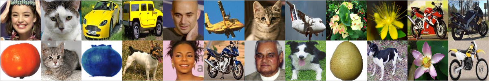

# Natural Image classification

[Link to the dataset on kaggle](https://www.kaggle.com/prasunroy/natural-images)

Example images from dataset:



Tensorflow based implementation with torch style.

Used model VGG16.


###Install dependencies
```bash
    pip install -r requirements.txt
```

###Starting train
```bash
    python src/train.py 
```

